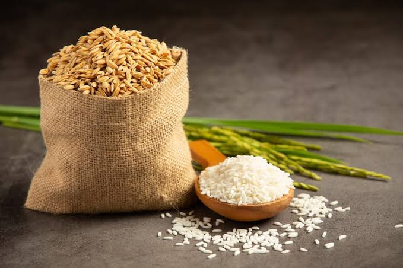
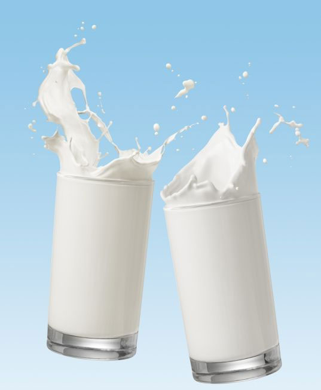
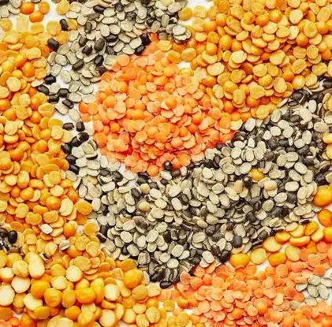

<!DOCTYPE html>
<html lang="en">
<head>
    <meta charset="UTF-8">
    <meta name="viewport" content="width=device-width, initial-scale=1.0">
    <title>Organic Farmer - Paddy, Cow Milk, Pulses | Hyderabad</title>
    
</head>
<body>
    <header>
        <h1>Organic Farmer - Hyderabad</h1>
        
Pure Organic Paddy, Fresh Daily Cow Milk & Healthy Pulses

    </header>
    <nav>
        <a href="#home">Home</a>
        <a href="#products">Products</a>
        <a href="#about">About</a>
        <a href="#contact">Contact</a>
    </nav>
    

        <section id="home" class="hero">
            <h2>Welcome to Our Organic Farm</h2>
            
We grow and produce everything organically—no chemicals, just nature's best. Sourced from Hyderabad, Telangana, for fresh delivery.[web:1]

        </section>
        <section id="products">
            <h2>Our Organic Products</h2>
            

                

                    
                    <h3>Organic Paddy</h3>
                    
Premium quality paddy grown using traditional organic methods. Nutrient-rich and flavorful.

                    
<strong>₹50 / kg</strong> | Available year-round

                

                

                    
                    <h3>Daily Cow Milk</h3>
                    
Fresh, unpasteurized milk straight from our cows. Delivered daily for ultimate freshness.

                    
<strong>₹60 / liter</strong> | Fresh every morning

                

                

                    
                    <h3>Organic Pulses</h3>
                    
Assorted pulses like moong, chana, and toor dal. 100% organic and protein-packed.

                    
<strong>₹100 / kg</strong> | Multiple varieties

                

            

        </section>
        <section id="about">
            <h2>About Our Farm</h2>
            
I am a dedicated farmer from Hyderabad, Telangana, specializing in organic farming. We prioritize sustainable practices to deliver healthy, chemical-free products like paddy, cow milk, and pulses to local customers.[web:2]

            
Our farm uses natural fertilizers, crop rotation, and traditional methods for the best quality.

        </section>
        <section id="contact">
            <h2>Get in Touch</h2>
            
<strong>Email:</strong> malothuyashwanth828@gmail.com.com (update this)

            
<strong>Phone:</strong> +91-6303083125 Maloth yashwanth

            
<strong>Location:</strong> Hyderabad, Telangana, India

            
Order now for fresh delivery!

        </section>
    

    <footer>
        
&copy; 2026 Organic Farmer Hyderabad. Proudly organic.

    </footer>
</body>
</html>
